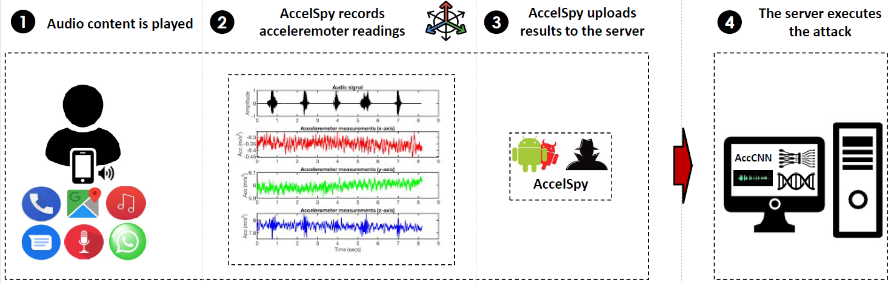
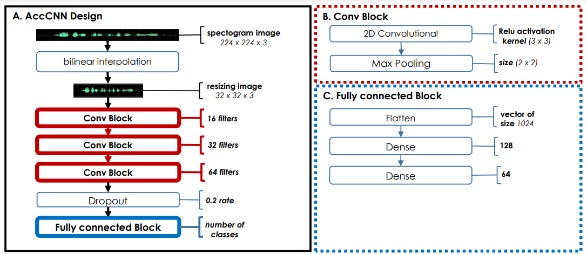
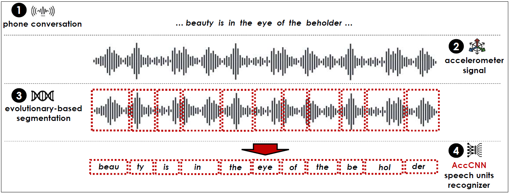
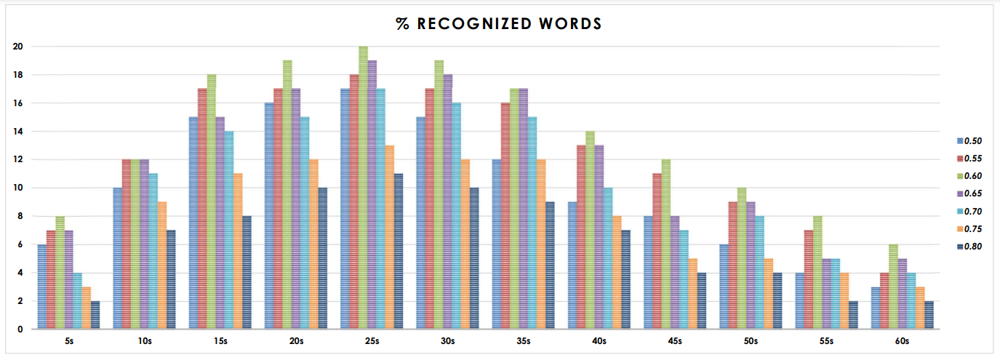

# AccelSpy 2.0, accelerometer recognition made simple.

AccelSpy 2.0 is a mobile application able to recognize, via the accelerometer and a server-side support, spoken text given a csv file.
Through AccelSpy we can control the accelerometer and decide, while reproducing audios, to use it to map the reproduced audio and to save it in the device memory.   
Once the file is saved, it will be possible to send it to a server that will process it and will return the recognized test displaying it in the console.  
All in an intuitive and user-friendly interface.  
The beating heart of AccelSpy is the evolutionary segmentation algorithm, that takes in input a csv file and recognises the various speech units in it.
To recognise the speech units, the evolutionary segmentation algorithm uses a neural model called CNN (convolutional neural network).
CNN was built with a dataset of 86 speech units having each 1800 samples, in csv format, collected from accelerometer recordings.
The 86 speech units were selected among the most frequent in a 50 proverbs range taken in account in the thesis.
To compose the model, various settings were tested in order to find the best one suited to our needs.
The code is public and can be easily consulted: the evolutionary algorithm code (written in Python) and the application code both (written in Java).

## Threat Model

## The CNN for recognizing single speech units

##  The steps of the proposed approach for recognizing entire words

## Percentage of recognized words as a function of the length of the sentences (from 5s to 60s) and for each length as a function of the length of the segments (from 0.50s to 0.80s)

## Features in app

- Reproduce audio
- Audio recording
- Csv recognising
- Server-side support

## User manual
[Here](https://drive.google.com/file/d/1OMvDjjPAt0Lz-O5Nw_cAK3dtz0hQV9Ta/view?usp=sharing), the user manual for the mobile application.

## Optimizations

The app is optimized for battery saving and knows when the accelerometer is not in use, so the app can turn it off.

## Installation

To start the app you need the latest version of [Android Studio](https://developer.android.com/studio).
For the test of the evolutionary segmentation algorithm, however, it is necessary to install [Python](https://www.python.org/downloads/).
    

## Tech Stack

**App:** Java

**Server:** Python

## Authors

- [@Givaa](https://github.com/Givaa)
- [@Michele-iodice](https://github.com/Michele-iodice)
